# MVP - Pipeline de Dados: Análise Salarial

Este projeto tem como objetivo construir um pipeline de dados utilizando **Databricks** para analisar a relação entre características profissionais e sociodemográficas e a faixa de renda anual dos indivíduos presentes na base de dados utilizada.

O projeto contempla as etapas de ingestão, armazenamento, tratamento, modelagem, avaliação da qualidade dos dados e análise das informações, seguindo uma arquitetura de dados em camadas.

O pipeline está organizado nas camadas **Raw, Bronze, Silver e Gold**, permitindo acompanhar a evolução dos dados desde sua ingestão até sua preparação para as análises de negócio. Este README apresenta o contexto do problema, o processo de carga e transformação dos dados, a modelagem e o catálogo, as verificações de qualidade, os resultados das análises e a autoavaliação do projeto.

---

## 1. Contexto de Negócios e Perguntas

### 1.1 Problema

Compreender quais características profissionais e sociodemográficas estão associadas às diferentes faixas de renda anual dos indivíduos representados no dataset.

A análise busca identificar relações entre variáveis como escolaridade, ocupação e quantidade de horas trabalhadas por semana e a faixa de renda anual dos indivíduos.

### 1.2 Objetivo

Analisar a relação entre características profissionais e sociodemográficas e a faixa de renda anual, estruturando os dados em um pipeline de processamento e transformação que permita responder às perguntas de negócio de forma organizada, reproduzível e orientada a dados.

### 1.3 Perguntas de negócio

1. **Escolaridade:** Como a faixa de renda varia de acordo com o nível de escolaridade dos indivíduos?
2. **Ocupação:** Quais ocupações apresentam as maiores proporções de indivíduos com renda anual superior a 50K?
3. **Jornada:** A quantidade de horas trabalhadas por semana está associada à proporção de indivíduos com renda anual superior a 50K?
4. **Escolaridade + ocupação:** A relação entre escolaridade e faixa de renda varia de acordo com a ocupação exercida?

### 1.4 Fonte dos dados

Os dados utilizados neste projeto são provenientes do dataset **Salary Prediction Classification**, disponibilizado na plataforma Kaggle.

[Dataset no Kaggle](https://www.kaggle.com/datasets/ayessa/salary-prediction-classification?utm_source=chatgpt.com)

O arquivo utilizado no projeto é:

`salary.csv`

O dataset contém informações profissionais e sociodemográficas de indivíduos, tendo como variável de interesse `salary`, que representa a faixa de renda anual do indivíduo.

### 1.5 Licença

A página do dataset no Kaggle apresenta a licença como **Unknown**. Dessa forma, não foi atribuída uma licença adicional ao conjunto de dados neste projeto.

### 1.6 Estrutura dos dados brutos

O arquivo `salary.csv` possui **32.561 registros e 15 colunas**.

As colunas disponíveis são:

| Coluna           | Descrição geral                         |
| ---------------- | --------------------------------------- |
| `age`            | Idade do indivíduo                      |
| `workclass`      | Classe ou categoria de trabalho         |
| `fnlwgt`         | Peso final utilizado na base censitária |
| `education`      | Nível de escolaridade                   |
| `education-num`  | Representação numérica da escolaridade  |
| `marital-status` | Estado civil                            |
| `occupation`     | Ocupação profissional                   |
| `relationship`   | Relação familiar                        |
| `race`           | Raça                                    |
| `sex`            | Sexo                                    |
| `capital-gain`   | Ganho de capital                        |
| `capital-loss`   | Perda de capital                        |
| `hours-per-week` | Horas trabalhadas por semana            |
| `native-country` | País de origem                          |
| `salary`         | Faixa de renda anual                    |

A variável `salary` será utilizada como referência para as análises, apresentando as categorias `<=50K` e `>50K`.

---

## 2. Carga dos Dados

### 2.1 Processo de ingestão

O processo de ingestão foi iniciado a partir do arquivo `salary.csv`, disponibilizado na área de armazenamento Raw do Databricks. O arquivo foi armazenado em um Volume e posteriormente lido utilizando o Apache Spark.

Nesta primeira etapa, o arquivo CSV foi carregado sem aplicação de transformações de qualidade. O objetivo foi preservar as características originais dos dados e realizar um diagnóstico inicial antes da criação das camadas de processamento.

A leitura foi realizada utilizando o Spark, com o cabeçalho do arquivo sendo utilizado como nome das colunas, inferência automática dos tipos de dados e vírgula como separador.
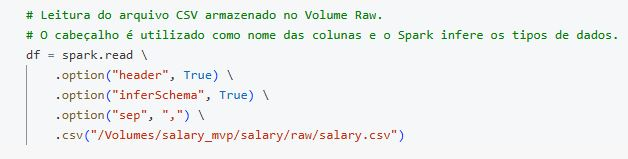

Após a leitura, foi realizado um diagnóstico inicial para compreender a estrutura e a qualidade do conjunto de dados antes da criação da camada Bronze. Foram verificadas:

* quantidade de registros e colunas;
* nomes das colunas;
* tipos de dados inferidos pelo Spark;
* existência de valores nulos;
* presença de valores ausentes representados pelo caractere `?`;
* existência de registros duplicados;
* distribuição da variável `salary`.

A base original apresentou **32.561 registros e 15 colunas**.

Durante o diagnóstico, foram identificados valores ausentes representados por `?` nas colunas `workclass`, `occupation` e `native-country`. Também foi realizada a verificação de registros duplicados considerando todas as colunas.
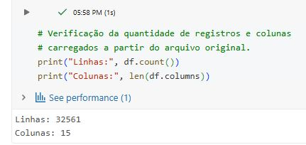
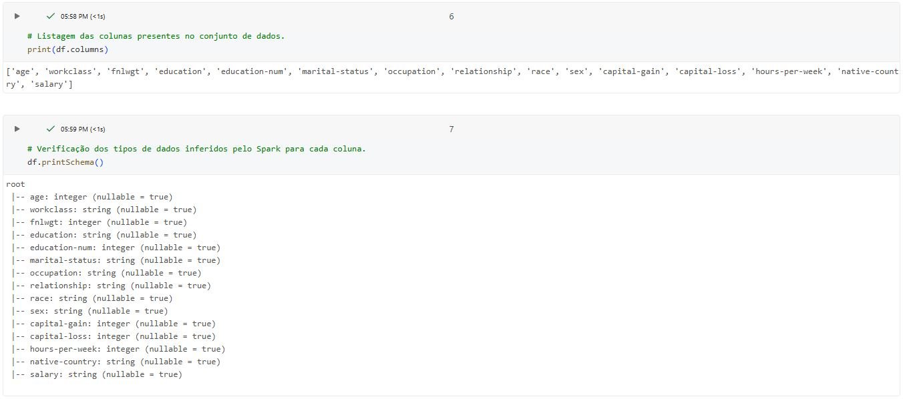
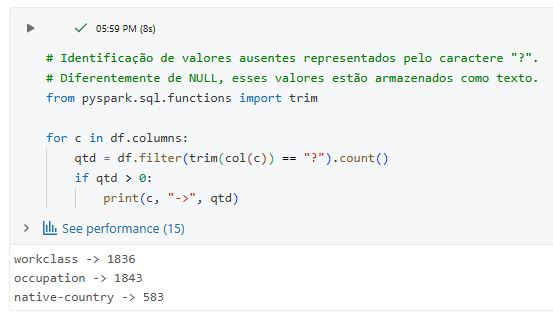
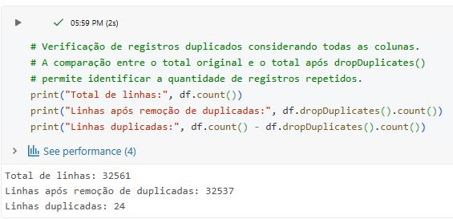

Por fim, foi analisada a distribuição da variável `salary`, que representa a faixa de renda anual e posteriormente foi utilizada como referência para a criação da variável binária na camada Gold e para as análises de negócio.

### 2.2 Armazenamento no Databricks

O arquivo original foi armazenado em um Volume Raw do Databricks, mantendo os dados em seu formato original antes da aplicação das transformações realizadas nas camadas seguintes do pipeline.

O caminho utilizado para a leitura do arquivo foi:

```text
/Volumes/salary_mvp/salary/raw/salary.csv
```

A partir desse arquivo, os dados foram utilizados como entrada para a construção da camada Bronze, responsável por representar os dados de origem dentro da arquitetura do pipeline.

As etapas de limpeza, padronização e tratamento dos problemas identificados no diagnóstico inicial foram realizadas posteriormente nas camadas de processamento.

---

## 3. Modelagem e Catálogo de Dados

### 3.1 Arquitetura Medalhão

O pipeline foi estruturado utilizando uma arquitetura de dados em camadas, baseada no conceito de **Medallion Architecture**. Essa abordagem organiza os dados de acordo com diferentes níveis de processamento, permitindo separar os dados de origem das etapas de tratamento e preparação para análise.

No projeto, foi utilizada a seguinte estrutura:

```text
Raw → Bronze → Silver → Gold
```

A área Raw contém o arquivo `salary.csv` em seu formato original, armazenado em um Volume do Databricks. A partir desse arquivo, os dados são carregados para a camada Bronze, mantendo a estrutura dos dados de origem.

A camada Silver é responsável pelo tratamento e padronização dos dados. Nessa etapa são realizados procedimentos de qualidade, como tratamento de valores ausentes, remoção de registros duplicados e padronização dos campos textuais.

A camada Gold contém os dados preparados para consumo e análise. Nessa camada foram criadas as variáveis `salary_binary` e `salary_range`, utilizadas para representar e classificar a faixa de renda e facilitar as análises de negócio.

A separação em camadas permite organizar o fluxo de processamento e facilita a rastreabilidade das transformações realizadas desde o dado original até os dados utilizados nas análises.

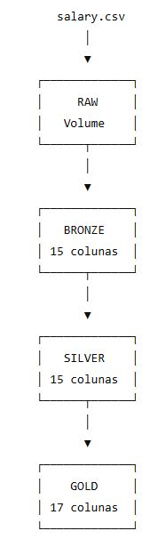

### 3.2 Modelo de dados

O modelo de dados foi organizado em três tabelas principais, correspondentes às camadas Bronze, Silver e Gold do pipeline. As tabelas estão organizadas no schema `salary` do catálogo `salary_mvp`.

| Camada | Tabela          | Quantidade de colunas | Finalidade                                                                |
| ------ | --------------- | --------------------: | ------------------------------------------------------------------------- |
| Bronze | `bronze_salary` |                    15 | Armazenar os dados provenientes da origem, mantendo sua estrutura inicial |
| Silver | `silver_salary` |                    15 | Armazenar os dados após os tratamentos de qualidade e padronização        |
| Gold   | `gold_salary`   |                    17 | Disponibilizar os dados preparados para as análises de negócio            |

As três tabelas são do tipo **Managed** e utilizam **Delta** como fonte de dados.

A tabela `bronze_salary` mantém as 15 colunas presentes no arquivo original.

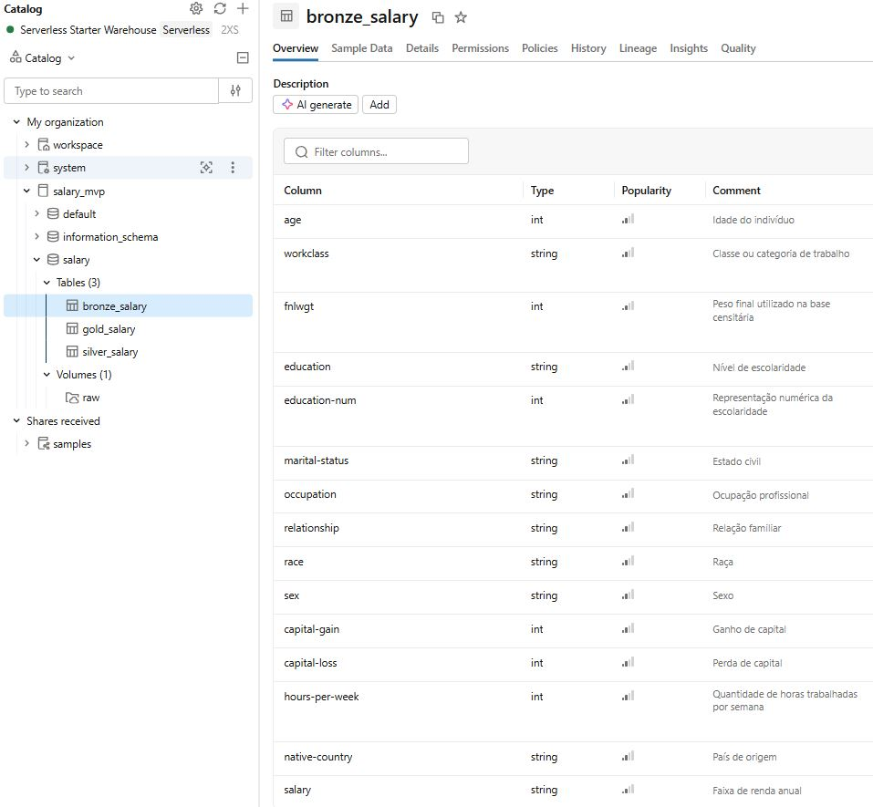

A tabela `silver_salary` mantém a mesma estrutura de 15 colunas, após a aplicação dos tratamentos de qualidade e padronização.

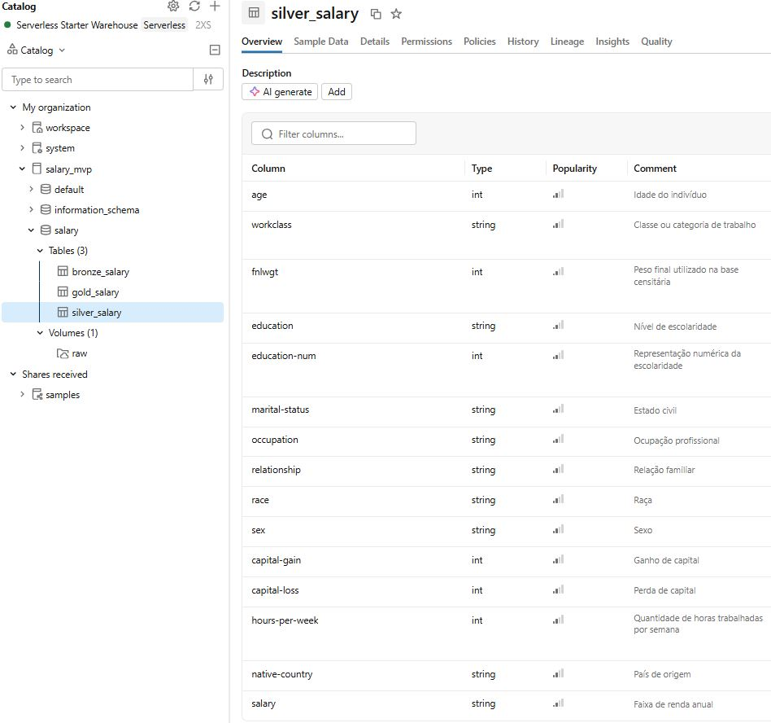

A tabela `gold_salary` contém as 15 colunas da Silver e acrescenta duas novas colunas utilizadas nas análises:

| Coluna          | Tipo     | Finalidade                                                                                            |
| --------------- | -------- | ----------------------------------------------------------------------------------------------------- |
| `salary_binary` | `int`    | Representar a faixa de renda de forma binária, sendo 0 para renda até 50K e 1 para renda acima de 50K |
| `salary_range`  | `string` | Classificar a faixa de renda utilizada na análise, com os valores "Até 50K" e "Acima de 50K"          |

Dessa forma, a camada Gold possui 17 colunas e representa a estrutura final utilizada nas análises de negócio.

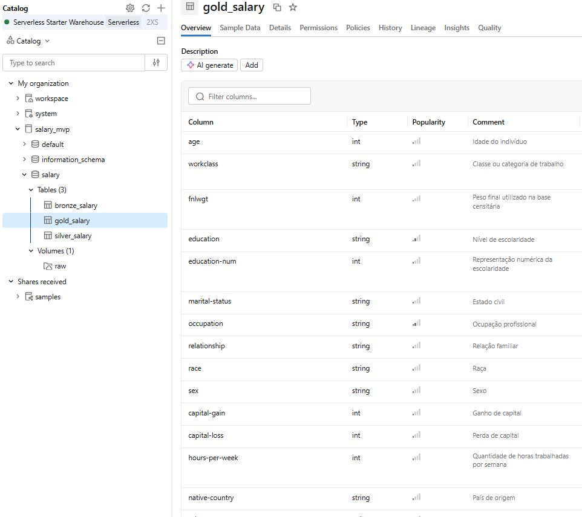
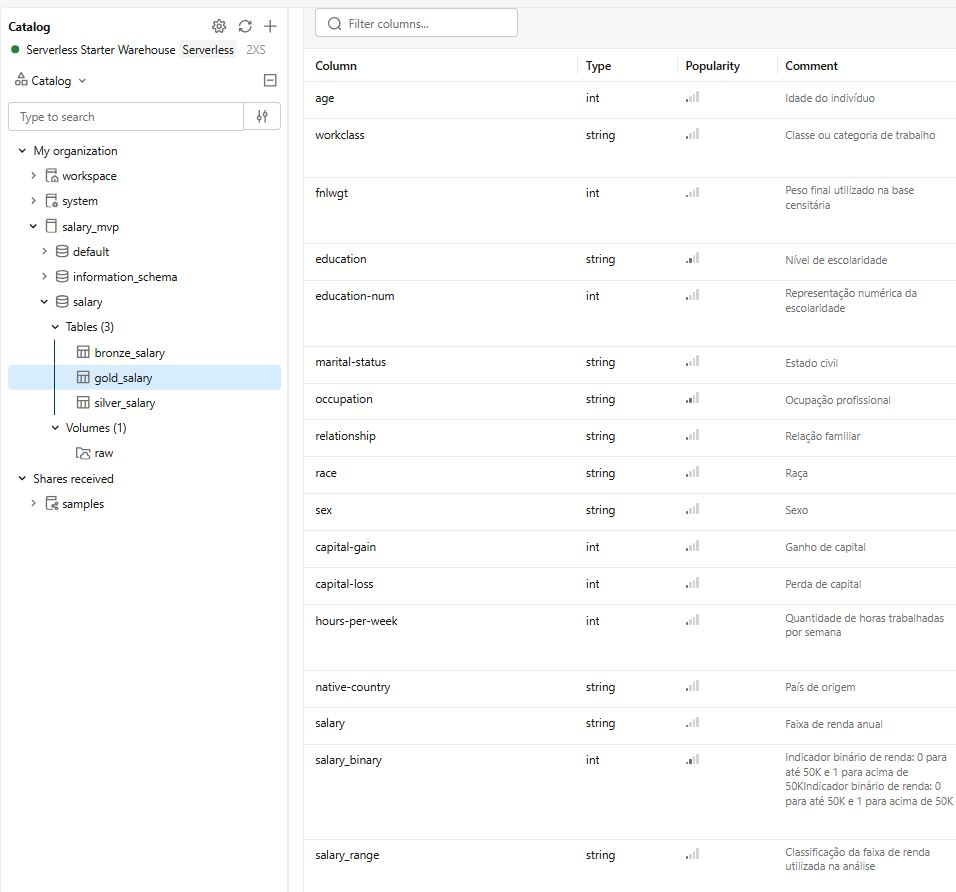

### 3.3 Catálogo de Dados

As tabelas do projeto foram organizadas no catálogo `salary_mvp`, dentro do schema `salary`. A estrutura apresentada no Databricks é:

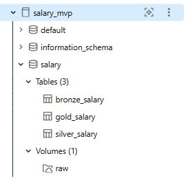

O Volume `raw` é utilizado para armazenar o arquivo de origem `salary.csv`, enquanto as tabelas `bronze_salary`, `silver_salary` e `gold_salary` representam as diferentes camadas de processamento do pipeline.

No catálogo do Databricks, as tabelas são apresentadas como **Managed**, utilizando **Delta** como fonte de dados. Além das informações estruturais, foram adicionados comentários às colunas das tabelas para documentar o significado de cada atributo e facilitar a compreensão dos dados.

Na camada Gold, os comentários também documentam as novas variáveis criadas para a análise, `salary_binary` e `salary_range`.

---

## 4. Pipeline de Dados

### 4.1 Bronze

A camada Bronze é responsável por persistir os dados provenientes da camada Raw, mantendo as características dos dados originalmente ingeridos.

Nesta etapa, não são aplicadas regras de limpeza, padronização ou transformação. O objetivo é manter uma representação dos dados de origem dentro do ambiente de processamento, permitindo sua utilização nas etapas posteriores do pipeline.

Os dados foram persistidos no formato Delta, utilizando uma tabela Managed no catálogo `salary_mvp`, na tabela `bronze_salary`.

A persistência foi realizada por meio do seguinte código:

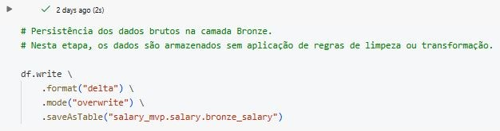

Após a criação da tabela, foi realizada uma validação para confirmar que os dados foram efetivamente persistidos no Databricks. A tabela foi consultada novamente e foram verificadas a quantidade de registros e a quantidade de colunas armazenadas.

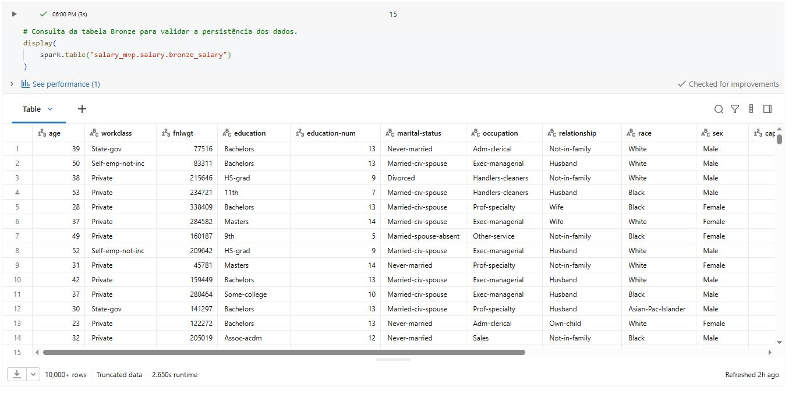
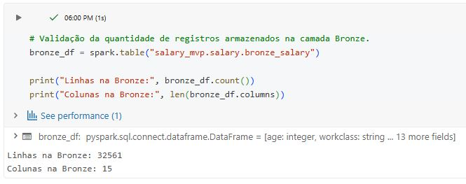

A validação confirmou a persistência dos dados na tabela `bronze_salary`, mantendo a estrutura original de **32.561 registros e 15 colunas**.

### 4.2 Silver

A camada Silver é construída a partir dos dados persistidos na camada Bronze. Nesta etapa são aplicadas as regras de tratamento e padronização necessárias para melhorar a qualidade dos dados, sem alterar a tabela Bronze.

Inicialmente, os dados são carregados da tabela `bronze_salary`.

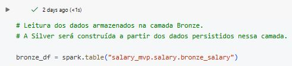

Em seguida, foram tratados os valores ausentes representados pelo caractere `?`. Nas colunas `workclass`, `occupation` e `native-country`, esses valores foram convertidos para `NULL`. Durante o mesmo processo, os valores textuais foram submetidos à função `trim()` para remover espaços desnecessários.

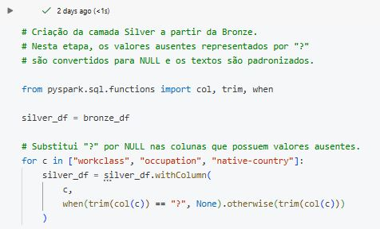

Após o tratamento dos valores ausentes, foram removidos os registros completamente duplicados, considerando todas as colunas do conjunto de dados.

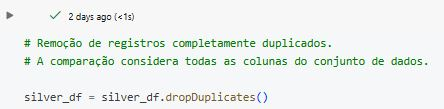

Após os tratamentos, a tabela Silver apresentou **32.537 registros e 15 colunas**. A quantidade de registros duplicados foi novamente verificada para confirmar a efetividade do tratamento.

Os dados tratados foram então persistidos em formato Delta na tabela `salary_mvp.salary.silver_salary`.

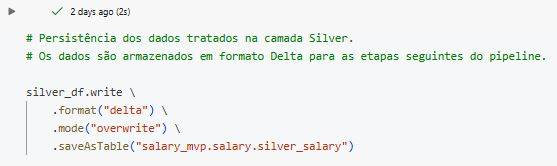

Após a persistência, a tabela foi consultada novamente para validar o resultado do processamento. Foram verificadas a quantidade de registros e colunas, além da quantidade de valores nulos existentes na tabela.

A validação confirmou a persistência dos dados tratados na camada Silver e sua disponibilidade para a construção da camada Gold.

### 4.3 Gold

A camada Gold é construída a partir dos dados tratados e persistidos na camada Silver. Nessa etapa, são realizadas transformações voltadas ao consumo analítico e à interpretação dos dados.

A variável `salary` é padronizada com `trim()` e utilizada para criar a variável `salary_binary`, que representa numericamente a faixa de renda:

* `0` → renda anual de até 50K;
* `1` → renda anual superior a 50K.

Também é criada a variável `salary_range`, que apresenta as mesmas categorias em formato textual mais descritivo:

* **Até 50K**;
* **Acima de 50K**.

Após as transformações, foram realizadas validações para verificar a correspondência entre `salary` e `salary_binary` e a representação textual da faixa de renda.

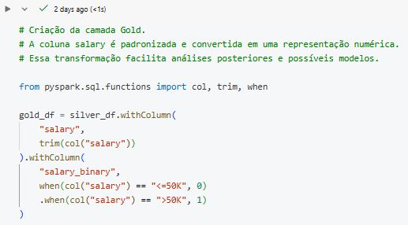

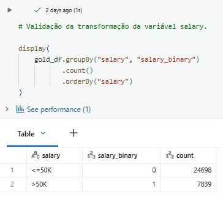

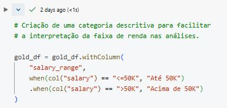

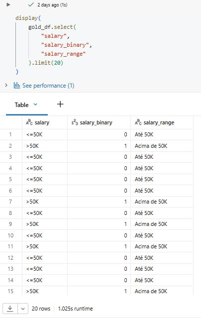

Após as transformações, os dados foram persistidos em formato Delta na tabela gerenciada `salary_mvp.salary.gold_salary`.

A tabela Gold possui **32.537 registros e 17 colunas**, sendo as duas colunas adicionais `salary_binary` e `salary_range`.

A persistência foi validada por meio da leitura da tabela diretamente do catálogo e da conferência da quantidade de registros e colunas.

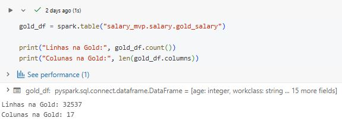

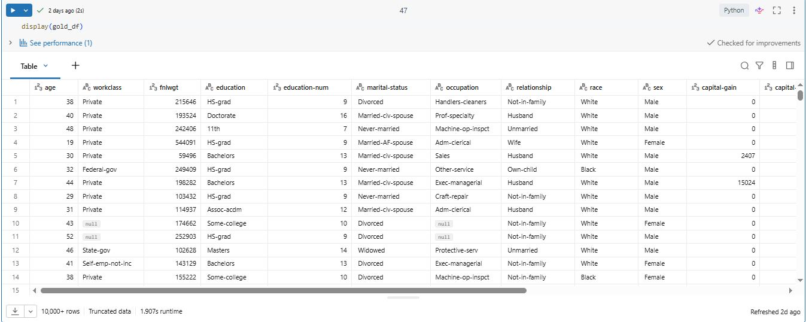

### 4.4 Transformações

As transformações foram realizadas de forma progressiva entre as camadas do pipeline, mantendo a separação entre os dados brutos, os dados tratados e os dados preparados para análise.

| Etapa           | Transformações realizadas                                                                                                                                             | Objetivo                                                                                                        |
| --------------- | --------------------------------------------------------------------------------------------------------------------------------------------------------------------- | --------------------------------------------------------------------------------------------------------------- |
| Raw → Bronze    | Leitura do arquivo `salary.csv` e persistência dos dados em formato Delta                                                                                             | Armazenar os dados originais em uma camada persistida, mantendo sua estrutura de origem                         |
| Bronze → Silver | Conversão dos valores `?` para `NULL`, aplicação de `trim()` nas colunas `workclass`, `occupation` e `native-country` e remoção de registros completamente duplicados | Melhorar a representação dos dados ausentes, padronizar os campos tratados e garantir a unicidade dos registros |
| Silver → Gold   | Padronização da variável `salary` e criação das variáveis `salary_binary` e `salary_range`                                                                            | Preparar os dados para o consumo analítico e facilitar os cálculos e a interpretação dos resultados             |

A separação das transformações em camadas permite preservar os dados de origem na Bronze, aplicar regras de qualidade na Silver e disponibilizar uma estrutura preparada para as análises de negócio na Gold.

Ao final do pipeline, as três camadas são mantidas como tabelas Delta gerenciadas no catálogo do Databricks:

* `salary_mvp.salary.bronze_salary`
* `salary_mvp.salary.silver_salary`
* `salary_mvp.salary.gold_salary`

---

## 5. Qualidade de Dados

A qualidade dos dados foi avaliada durante as etapas de diagnóstico da camada Raw e de tratamento da camada Silver. Também foram realizadas verificações adicionais na camada Gold, com o objetivo de identificar valores extremos antes das análises de negócio.

### 5.1 Completude

Durante a análise inicial dos dados brutos, foram identificados valores ausentes representados pelo caractere `?` nas seguintes colunas:

| Coluna           | Quantidade de valores ausentes |
| ---------------- | -----------------------------: |
| `workclass`      |                          1.836 |
| `occupation`     |                          1.843 |
| `native-country` |                            583 |

Esses valores foram identificados durante a inspeção inicial da camada Raw. Na camada Silver, o caractere `?` foi convertido para `NULL`, permitindo representar os dados ausentes de forma mais adequada para o processamento com Spark.

A conversão para `NULL` não recupera as informações ausentes, mas melhora sua representação e facilita a identificação desses registros nas etapas seguintes.

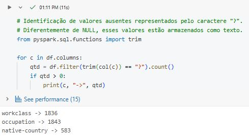

### 5.2 Consistência

Foram identificados valores representados pelo caractere `?` em três colunas textuais: `workclass`, `occupation` e `native-country`.

Para melhorar a consistência da representação dos dados, esses valores foram convertidos para `NULL`. Também foi utilizada a função `trim()` nessas colunas para remover espaços em branco no início e no final dos textos tratados.

Na camada Gold, a variável `salary` também foi padronizada com `trim()`, garantindo que os valores utilizados nas transformações correspondessem às categorias esperadas:

* `<=50K`;
* `>50K`.

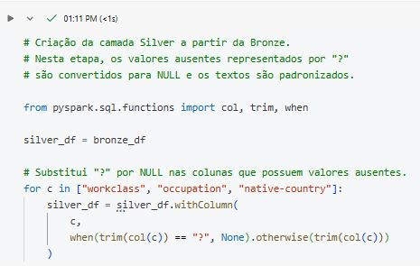

### 5.3 Unicidade

Na análise inicial da camada Raw, foram identificadas duplicidades exatas por meio da comparação entre a quantidade total de registros e a quantidade de registros após a aplicação de `dropDuplicates()`.

A base inicial possuía **32.561 registros**. Após a remoção das duplicidades exatas, a camada Silver passou a possuir **32.537 registros**, indicando a remoção de **24 registros duplicados**.

O tratamento foi realizado considerando todas as colunas do conjunto de dados. Dessa forma, foram removidos apenas registros completamente iguais, sem eliminar registros que apresentassem diferenças em algum campo.

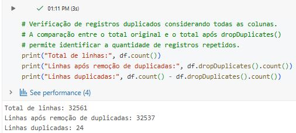

### 5.4 Acurácia

A acurácia dos dados não pôde ser validada integralmente, pois o projeto utilizou um dataset externo e não havia uma fonte de referência independente para confirmar individualmente os valores registrados.

Entretanto, foram realizadas verificações relacionadas à estrutura dos dados, aos tipos das colunas, à presença de valores ausentes, à distribuição da variável `salary` e à correspondência entre `salary`, `salary_binary` e `salary_range`.

Essas verificações contribuíram para identificar problemas de representação e consistência, mas não permitem garantir que todos os valores originais estejam corretos.

### 5.5 Outliers

Foram realizadas verificações estatísticas e análises de valores mínimos e máximos das principais variáveis numéricas.

Os resultados encontrados foram:

| Variável         | Mínimo | Máximo | Mediana |
| ---------------- | -----: | -----: | ------: |
| `age`            |     17 |     90 |      37 |
| `education-num`  |      1 |     16 |      10 |
| `hours-per-week` |      1 |     99 |      40 |
| `capital-gain`   |      0 | 99.999 |       0 |
| `capital-loss`   |      0 |  4.356 |       0 |

As variáveis `capital-gain` e `capital-loss` apresentaram concentração de valores iguais a zero e valores máximos significativamente superiores à mediana. A variável `hours-per-week` apresentou valores entre 1 e 99 horas semanais, incluindo **341 registros com 80 horas ou mais**.

Esses valores foram considerados extremos ou potencialmente atípicos. Entretanto, não foram removidos, pois não havia evidências suficientes para afirmar que representavam erros de preenchimento. A exclusão automática poderia eliminar informações legítimas presentes na base.

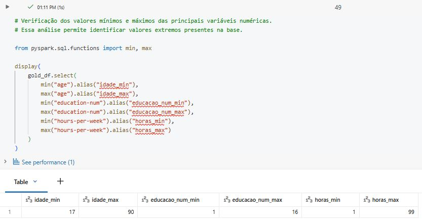

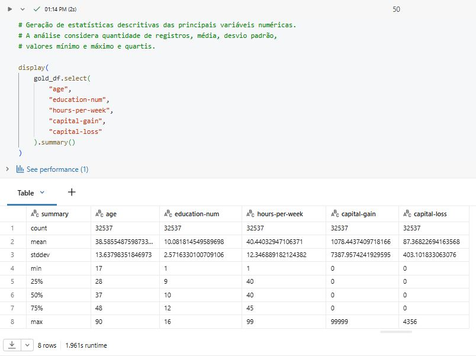

### 5.6 Tratamentos realizados

Os principais tratamentos aplicados ao longo do pipeline foram:

| Camada     | Tratamento realizado                                                                  |
| ---------- | ------------------------------------------------------------------------------------- |
| **Bronze** | Persistência dos dados brutos em formato Delta, sem aplicação de regras de limpeza    |
| **Silver** | Conversão de `?` para `NULL` nas colunas `workclass`, `occupation` e `native-country` |
| **Silver** | Aplicação de `trim()` nas colunas textuais tratadas                                   |
| **Silver** | Remoção de registros completamente duplicados                                         |
| **Gold**   | Padronização da variável `salary`                                                     |
| **Gold**   | Criação da variável numérica `salary_binary`                                          |
| **Gold**   | Criação da variável textual `salary_range`                                            |

As transformações foram aplicadas de forma progressiva, preservando os dados originais na camada Bronze e disponibilizando dados tratados e estruturados nas camadas Silver e Gold.

Os valores extremos identificados durante a análise não foram removidos. Essa decisão foi registrada como uma limitação metodológica, considerando que não havia uma fonte externa para validar a existência de erros nesses registros.

---

## 6. Análise de Dados

### 6.1 Pergunta 1 — Escolaridade

**Pergunta:** Como a faixa de renda varia de acordo com o nível de escolaridade?

Para responder a essa pergunta, foi calculada a proporção de indivíduos com renda anual superior a 50K dentro de cada nível de escolaridade. A análise foi realizada sobre a camada Gold, utilizando a variável `salary_binary`, em que 0 representa renda de até 50K e 1 representa renda superior a 50K.

Os resultados indicam diferenças expressivas entre os níveis de escolaridade. Entre os indivíduos classificados como `Doctorate`, **74,09%** apresentam renda superior a 50K, enquanto no grupo `Prof-school` esse percentual é de **73,44%**. Para `Masters`, a proporção é de **55,69%**, e para `Bachelors`, de **41,49%**.

Nos níveis de escolaridade mais baixos, as proporções são menores. Entre os indivíduos classificados como `HS-grad`, **15,95%** apresentam renda superior a 50K. Já nos grupos `9th`, `5th-6th` e `1st-4th`, os percentuais são de **5,25%**, **4,82%** e **3,61%**, respectivamente.

Dessa forma, os dados analisados apresentam uma associação entre nível de escolaridade e faixa de renda: níveis mais elevados de escolaridade estão associados a maiores proporções de indivíduos na faixa de renda superior a 50K. Essa relação deve ser interpretada como uma associação observada na base de dados, não como uma relação de causalidade.

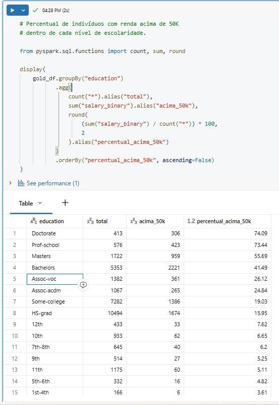

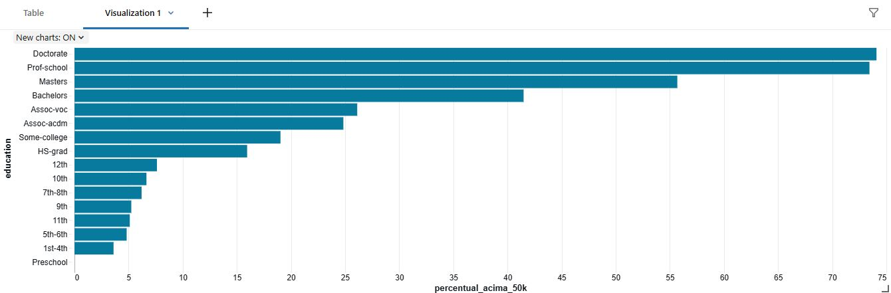

### 6.2 Pergunta 2 — Ocupação

**Pergunta:** Quais ocupações apresentam as maiores proporções de indivíduos com renda anual superior a 50K?

Para responder a essa pergunta, foi calculada a proporção de indivíduos com renda anual superior a 50K dentro de cada ocupação. A análise foi realizada sobre a camada Gold, utilizando a variável `salary_binary`, em que 0 representa renda de até 50K e 1 representa renda superior a 50K.

Os resultados indicam diferenças entre as ocupações analisadas. Entre os indivíduos classificados como `Exec-managerial`, **48,41%** apresentam renda superior a 50K, sendo essa a maior proporção observada entre as ocupações com registros válidos. Em seguida, `Prof-specialty` apresenta **44,92%**, enquanto `Protective-serv` apresenta **32,51%** e `Tech-support`, **30,53%**.

A ocupação `Sales` apresenta uma proporção de **26,93%**, seguida por `Craft-repair`, com **22,69%**, e `Transport-moving`, com **20,04%**.

Nas demais ocupações, as proporções são menores. Entre `Adm-clerical`, **13,46%** dos indivíduos apresentam renda superior a 50K, enquanto `Machine-op-inspct` apresenta **12,45%** e `Farming-fishing`, **11,59%**. Para `Handlers-cleaners`, `Other-service` e `Priv-house-serv`, os percentuais são de **6,28%**, **4,16%** e **0,68%**, respectivamente.

A tabela também apresenta uma categoria `NULL`, composta por **1.843 registros** cuja ocupação não estava informada na base original. Esses registros correspondem aos valores `?` que foram tratados como valores ausentes durante a preparação da camada Silver. Nesse grupo, **10,36%** dos indivíduos apresentam renda superior a 50K.

Como `NULL` não representa uma ocupação propriamente dita, esses registros foram mantidos na tabela para transparência e controle dos dados, mas não foram considerados como uma categoria ocupacional na visualização gráfica.

Dessa forma, na base analisada, `Exec-managerial` e `Prof-specialty` apresentam as maiores proporções de indivíduos com renda superior a 50K, com **48,41%** e **44,92%**, respectivamente.

Os resultados demonstram uma diferença nas proporções de renda superior a 50K entre as ocupações, devendo essa relação ser interpretada como uma associação observada na base de dados, e não como uma relação de causalidade.

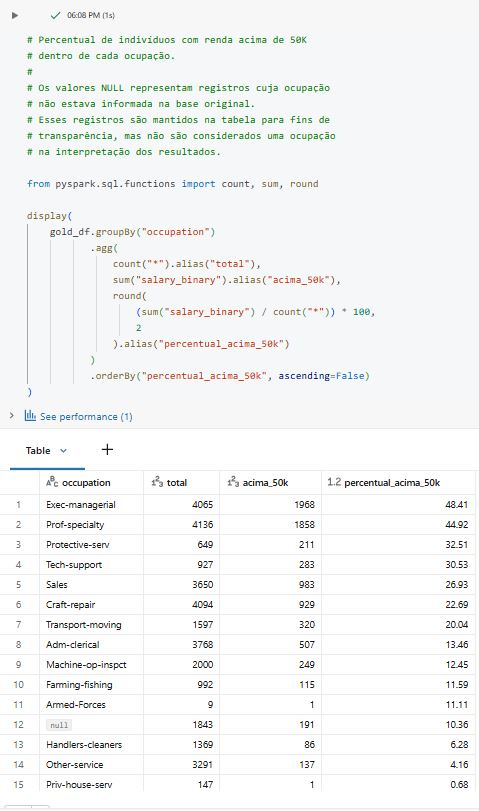

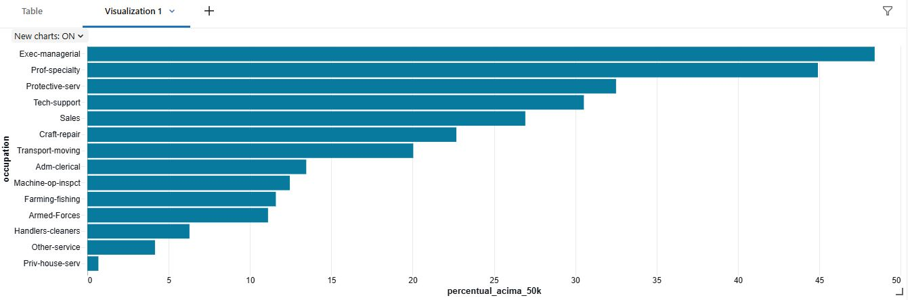

### 6.3 Pergunta 3 — Jornada de trabalho

**Pergunta:** A quantidade de horas trabalhadas por semana está associada à proporção de indivíduos com renda anual superior a 50K?

Para analisar essa questão, os indivíduos foram agrupados em faixas de horas trabalhadas por semana. Essa abordagem foi utilizada porque a análise de cada quantidade exata de horas gerava grupos muito pequenos em algumas categorias, o que poderia produzir percentuais elevados ou reduzidos sem representar um número significativo de indivíduos.

Em seguida, foi calculado o percentual de indivíduos com renda anual superior a 50K dentro de cada faixa de jornada. A variável `salary_binary` foi utilizada para identificar os indivíduos com renda acima de 50K, sendo 1 para renda superior a 50K e 0 para renda de até 50K.

Os resultados mostram uma tendência de aumento da proporção de indivíduos com renda superior a 50K conforme aumenta a quantidade de horas trabalhadas, principalmente entre as faixas de até 20 horas e 51–60 horas semanais. A proporção passa de **6,67%** na faixa de até 20 horas para **43,44%** entre aqueles que trabalham de 51 a 60 horas por semana.

Após a faixa de 51–60 horas, observa-se uma redução gradual na proporção, chegando a **30,29%** entre os indivíduos que trabalham mais de 80 horas semanais.

Dessa forma, os dados apresentam uma associação entre jornada semanal e proporção de indivíduos com renda superior a 50K, mas essa relação não deve ser interpretada como causalidade.

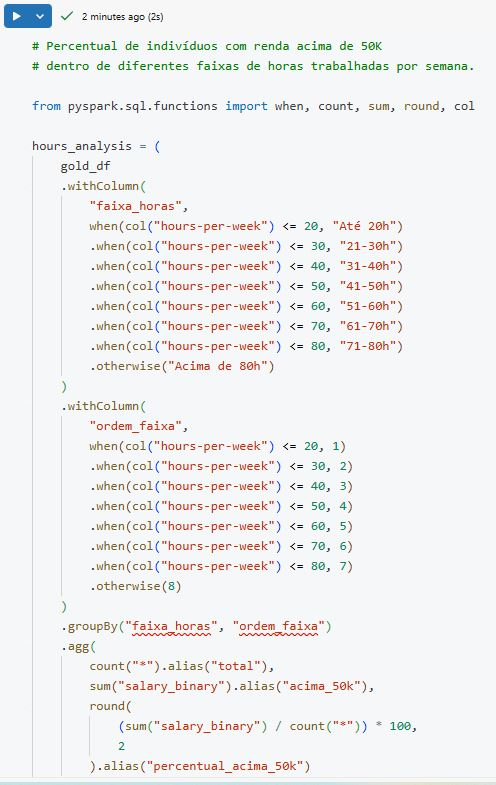

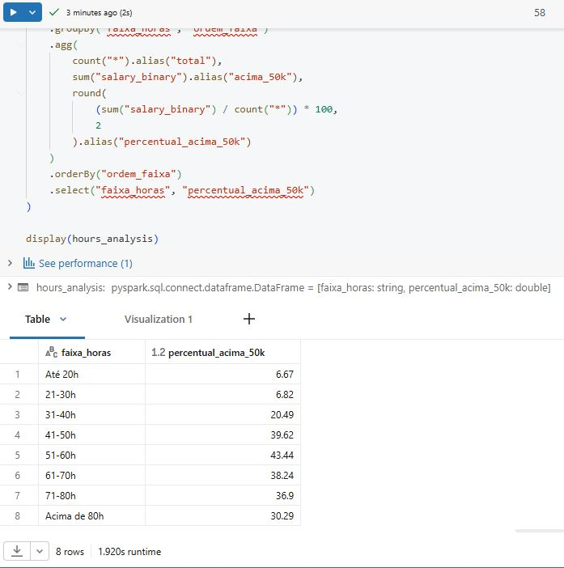

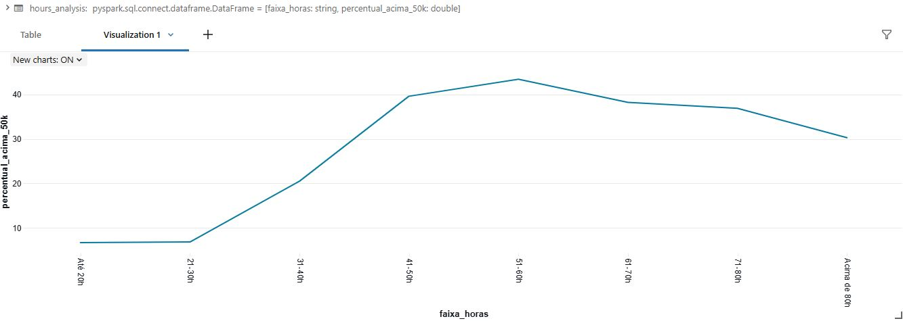

### 6.4 Pergunta 4 — Escolaridade + ocupação

**Pergunta:** A relação entre escolaridade e faixa de renda varia de acordo com a ocupação exercida?

Para investigar essa relação, foi realizada uma análise conjunta das variáveis `education` e `occupation`, calculando, para cada combinação, o percentual de indivíduos com renda anual superior a 50K.

Para facilitar a comparação e a visualização dos resultados, foram selecionadas cinco ocupações com maior representatividade em quantidade de registros para a visualização comparativa:

* `Exec-managerial`
* `Prof-specialty`
* `Sales`
* `Craft-repair`
* `Adm-clerical`

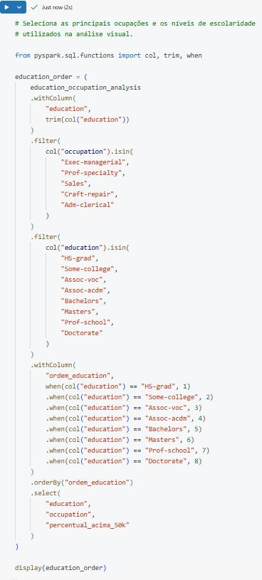

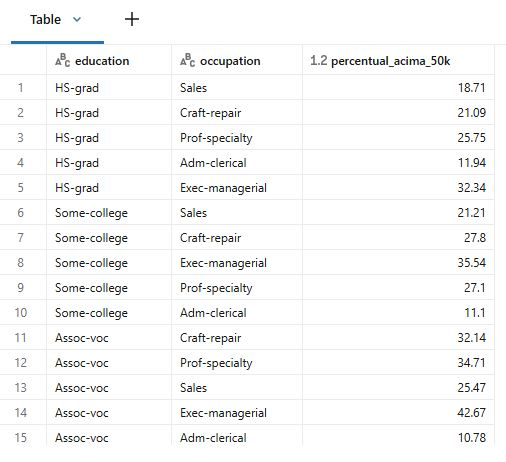

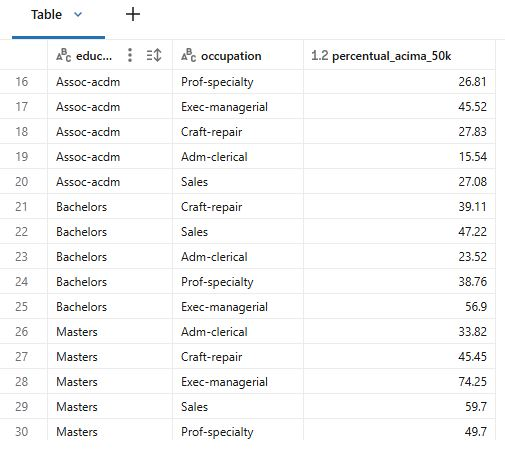

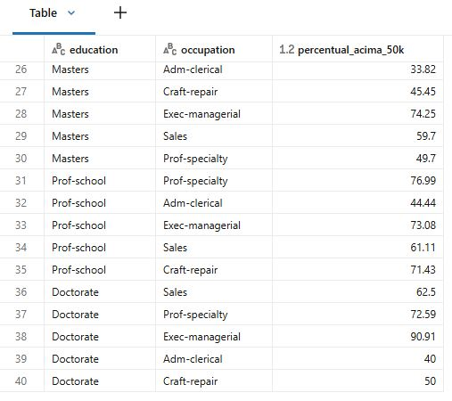

Os resultados indicam que a proporção de indivíduos com renda superior a 50K tende a aumentar conforme o nível de escolaridade se eleva, mas essa relação apresenta intensidades diferentes entre as ocupações.

Por exemplo, em `Exec-managerial`, o percentual passa de **32,34%** entre indivíduos com ensino médio completo (`HS-grad`) para **56,90%** entre aqueles com `Bachelors`, **74,25%** com `Masters` e **90,91%** com `Doctorate`.

Em `Adm-clerical`, a variação é mais moderada, passando de **11,94%** em `HS-grad` para **23,52%** em `Bachelors`, **33,82%** em `Masters` e **40,00%** em `Doctorate`.

Já em `Prof-specialty`, o percentual chega a **76,99%** entre indivíduos com `Prof-school` e **72,59%** entre aqueles com `Doctorate`.

Dessa forma, os resultados sugerem que a associação observada entre escolaridade e renda não se apresenta da mesma maneira em todas as ocupações.

Entretanto, alguns cruzamentos entre escolaridade e ocupação possuem uma quantidade reduzida de registros, especialmente nos níveis mais altos de escolaridade. Por esse motivo, percentuais extremos observados nesses grupos, como os **90,91%** de indivíduos acima de 50K em `Doctorate + Exec-managerial`, devem ser interpretados com cautela, pois podem ser mais sensíveis à pequena quantidade de observações.

Assim, os resultados são utilizados principalmente para identificar padrões gerais na base, e não para estabelecer conclusões definitivas sobre grupos com baixa representatividade.

De forma geral, a análise mostra que a relação entre escolaridade e faixa de renda varia de acordo com a ocupação exercida. Na base analisada, níveis mais elevados de escolaridade estão associados a maiores proporções de indivíduos com renda superior a 50K em diversas ocupações, mas a intensidade dessa associação não é uniforme entre elas.

Esses resultados representam associações observadas nos dados e não permitem afirmar que a escolaridade ou a ocupação, isoladamente, causem o aumento da renda.

#### Principais resultados

| Escolaridade   | Adm-clerical | Craft-repair | Exec-managerial | Prof-specialty |  Sales |
| -------------- | -----------: | -----------: | --------------: | -------------: | -----: |
| `HS-grad`      |       11,94% |       21,09% |          32,34% |         25,75% | 18,71% |
| `Some-college` |       11,10% |       27,80% |          35,54% |         27,10% | 21,21% |
| `Assoc-voc`    |       10,78% |       32,14% |          42,67% |         34,71% | 25,47% |
| `Assoc-acdm`   |       15,54% |       27,83% |          45,52% |         26,81% | 27,08% |
| `Bachelors`    |       23,52% |       39,11% |          56,90% |         38,76% | 47,22% |
| `Masters`      |       33,82% |       45,45% |          74,25% |         49,70% | 59,70% |
| `Prof-school`  |       44,44% |       71,43% |          73,08% |         76,99% | 61,11% |
| `Doctorate`    |       40,00% |       50,00% |          90,91% |         72,59% | 62,50% |

A tabela apresenta os percentuais de indivíduos com renda superior a 50K para cada combinação entre escolaridade e as cinco ocupações selecionadas. A seleção permite uma comparação mais objetiva entre grupos com maior representatividade na base.

**Visualização:** o heatmap apresenta os mesmos percentuais da tabela, permitindo identificar visualmente como a proporção de indivíduos com renda superior a 50K varia conforme a escolaridade e a ocupação. As cores mais intensas representam maiores percentuais.

A interpretação do heatmap deve considerar também a quantidade de registros existente em cada combinação, especialmente nos grupos de menor representatividade. Portanto, valores elevados em grupos muito pequenos não devem ser interpretados isoladamente como evidência de um padrão geral.

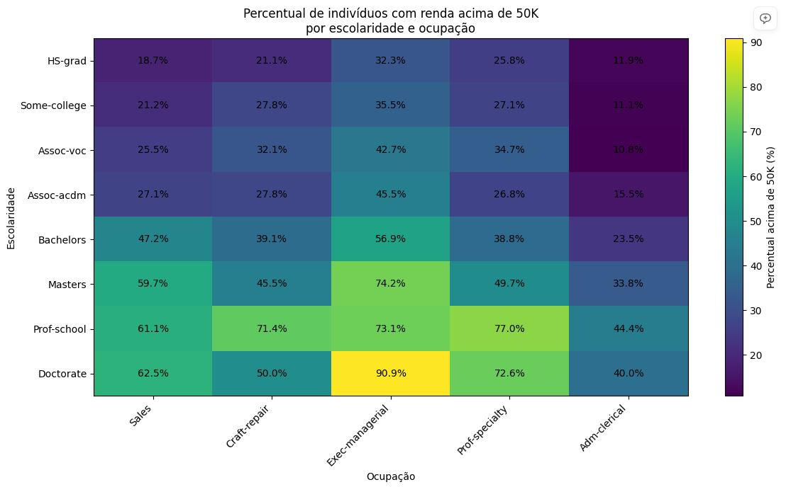

### 6.5 Discussão dos resultados

A análise das quatro perguntas de negócio permite observar diferentes relações entre as características profissionais e sociodemográficas dos indivíduos e a faixa de renda anual na base analisada.

A escolaridade apresentou uma associação evidente com a proporção de indivíduos com renda superior a 50K. Os níveis mais elevados de escolaridade apresentaram, de modo geral, percentuais maiores de indivíduos nessa faixa de renda. Esse comportamento também foi observado quando a escolaridade foi analisada em conjunto com diferentes ocupações, embora a intensidade da relação variasse entre elas.

A ocupação também apresentou diferenças relevantes. Ocupações como `Exec-managerial` e `Prof-specialty` apresentaram proporções maiores de indivíduos com renda superior a 50K do que ocupações como `Adm-clerical`, `Handlers-cleaners` e `Priv-house-serv`. Esses resultados indicam que a distribuição da renda não é uniforme entre os diferentes tipos de ocupação presentes na base.

A jornada de trabalho apresentou um comportamento diferente. A proporção de indivíduos com renda superior a 50K aumentou entre as menores faixas de horas trabalhadas e atingiu **43,44%** na faixa de 51 a 60 horas semanais. Entretanto, após essa faixa, a proporção diminuiu, chegando a **30,29%** entre os indivíduos que trabalhavam mais de 80 horas semanais. Portanto, a relação observada não apresentou um comportamento linear em toda a distribuição de horas trabalhadas.

A análise conjunta entre escolaridade e ocupação permitiu observar que a associação entre escolaridade e renda não ocorre com a mesma intensidade em todas as ocupações. Em algumas ocupações, como `Exec-managerial`, o aumento da escolaridade esteve acompanhado de diferenças expressivas na proporção de indivíduos com renda superior a 50K. Em outras, como `Adm-clerical`, essa variação foi mais moderada. Isso demonstra a importância de considerar diferentes características simultaneamente ao analisar a distribuição da renda.

De forma integrada, os resultados sugerem que escolaridade, ocupação e jornada de trabalho apresentam associações com a faixa de renda observada na base, mas essas relações possuem comportamentos diferentes e não devem ser analisadas de forma isolada. A análise conjunta mostrou que a relação entre uma característica e a renda pode variar conforme outra característica do indivíduo.

É importante destacar que as análises realizadas são predominantemente descritivas e identificam associações presentes nos dados. Elas não permitem estabelecer relações de causalidade entre escolaridade, ocupação, jornada de trabalho e renda.

Além disso, alguns cruzamentos apresentam poucos registros, o que exige cautela na interpretação de percentuais extremos. A presença de valores ausentes em algumas variáveis e a ausência de uma fonte externa para validação individual dos registros também constituem limitações da análise.

Assim, o pipeline desenvolvido permite responder às perguntas de negócio propostas e identificar padrões relevantes na base, fornecendo uma visão estruturada das relações observadas entre características profissionais, sociodemográficas e faixa de renda.

---

## 7. Autoavaliação

### 7.1 Objetivos atingidos

O projeto atingiu o objetivo de construir um pipeline de dados completo utilizando Databricks, desde a ingestão do arquivo bruto até a disponibilização de dados estruturados para análise.

Foram implementadas as camadas Raw, Bronze, Silver e Gold, com separação das responsabilidades de armazenamento, tratamento e preparação dos dados. Os dados foram persistidos em formato Delta e organizados no catálogo do Databricks.

Também foram realizadas verificações de qualidade, incluindo análise de valores ausentes, duplicidades, consistência e valores extremos. Na camada Gold, foram criadas variáveis específicas para apoiar as análises, como `salary_binary` e `salary_range`.

Por fim, foram respondidas quatro perguntas de negócio relacionadas à escolaridade, ocupação, jornada de trabalho e à relação conjunta entre escolaridade e ocupação. As análises foram acompanhadas de visualizações e interpretações dos resultados.

### 7.2 Dificuldades

Durante o desenvolvimento, uma das principais dificuldades foi estruturar o fluxo de dados de forma que cada camada tivesse uma finalidade bem definida. Foi necessário compreender a diferença entre preservar os dados na Bronze, aplicar tratamentos na Silver e preparar os dados para consumo analítico na Gold.

Outra dificuldade esteve relacionada ao tratamento dos valores ausentes representados por `?` e à identificação de registros duplicados. Também foi necessário avaliar como lidar com valores extremos sem removê-los automaticamente, considerando que um valor atípico não necessariamente representa um erro.

Na etapa de análise, houve ainda a necessidade de adaptar a forma de agrupamento das horas trabalhadas por semana. A análise por quantidade exata de horas produzia alguns grupos muito pequenos, dificultando a interpretação dos percentuais. Por isso, foram utilizadas faixas de horas para obter uma visão mais representativa da distribuição.

### 7.3 Limitações

Uma das principais limitações do projeto é que o dataset utilizado é externo e não possui uma fonte independente disponível para validação individual dos registros. Dessa forma, foi possível avaliar aspectos de estrutura, consistência e qualidade dos dados, mas não garantir a acurácia de cada valor presente na base.

Também existem valores ausentes em algumas variáveis, que foram representados como `NULL` na camada Silver. O tratamento realizado melhora a representação desses valores, mas não permite recuperar as informações originalmente ausentes.

As análises realizadas são predominantemente descritivas e identificam associações entre as variáveis. Portanto, os resultados não permitem estabelecer relações de causalidade entre escolaridade, ocupação, jornada de trabalho e faixa de renda.

Além disso, alguns cruzamentos entre escolaridade e ocupação possuem poucos registros. Nesses casos, percentuais elevados ou reduzidos podem ser mais sensíveis ao tamanho reduzido do grupo e devem ser interpretados com cautela.

### 7.4 Trabalhos futuros

Como possíveis evoluções do projeto, poderiam ser realizadas análises estatísticas mais aprofundadas para avaliar simultaneamente o efeito de diferentes características sobre a faixa de renda.

Também seria possível incorporar novas fontes de dados e realizar validações externas, aumentando a capacidade de avaliar a qualidade e a representatividade dos registros.

Outra possibilidade seria ampliar a camada Gold com novas métricas e dimensões analíticas, permitindo a criação de dashboards e indicadores para acompanhamento dos resultados.

Por fim, o pipeline poderia ser automatizado para execução periódica, incluindo mecanismos adicionais de monitoramento da qualidade dos dados e atualização das tabelas analíticas.
